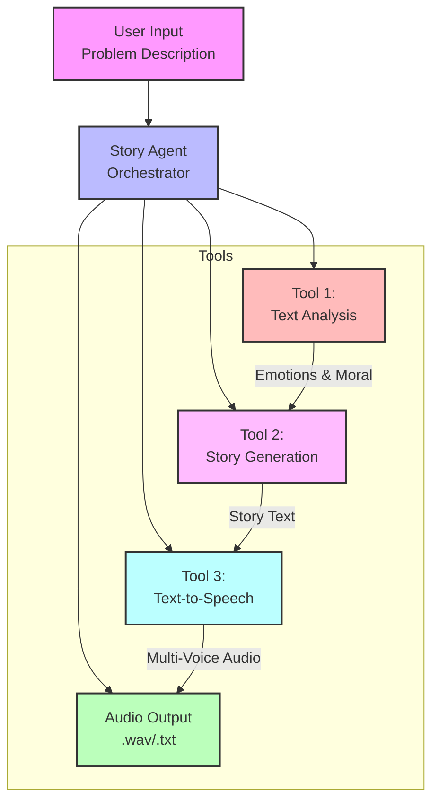

# Story Teller AI Agent 🎭

A goal-oriented AI agent that creates personalized children's stories to help address behavioral problems through gentle, therapeutic storytelling.

## Overview

The Story Teller AI Agent processes descriptions of children's behavioral challenges and creates personalized fairy tales that teach appropriate behavior through engaging storytelling. The agent uses a three-tool pipeline to transform behavioral probl💡 Tip: Play the audio file to share the story with your child!

<audio controls>
   <source src="https://raw.githubusercontent.com/saprykins/AI-Bedtime-Stories/blob/main/output/story_1758383964.wav" type="audio/wav">
  Your browser does not support the audio element.
</audio>

```

### Example Story

Here's an example story generated by the AI agent about sharing at school:

Listen to a sample story (right-click and "Save link as" to download):
[📁 Sample Story (WAV)](https://github.com/saprykins/AI-Bedtime-Stories/blob/main/output/story_1758383964.wav)

You can also listen directly here:
<audio controls>
  <source src="https://github.com/saprykins/AI-Bedtime-Stories/blob/main/output/story_1758383964.wav" type="audio/wav">
  Your browser does not support the audio element.
</audio>

📁 Output file: story_1758383964.wav

The story features engaging dialogue between characters using different voices:
- Male voice (en-US-ChristopherNeural): Narrator and male characters
- Female voice (en-US-SaraNeural): Female characters and young animals

This multi-voice approach makes the story more engaging and helps children better connect with different characters in the narrative.
```

### Project Structureinto therapeutic bedtime stories.

## Architecture

### System Architecture


### Agent Pipeline

The Story Teller AI Agent follows a structured three-step process:

#### **Step 1: Text Analysis Tool** 🔍
- **Purpose**: Analyze the behavioral problem and extract key story elements
- **Input**: Raw problem description (e.g., "My son got into a fight at school")
- **Process**: 
  - Identifies problem type (sharing conflict, aggression, lying, etc.)
  - Extracts underlying emotions (anger, frustration, fear)
  - Determines appropriate moral lesson
  - Selects suitable animal character
- **Output**: Structured analysis with problem type, emotions, moral, and character
- **Fallback**: Keyword-based analysis when Azure OpenAI is unavailable

#### **Step 2: Story Generation Tool** 📚
- **Purpose**: Create a personalized fairy tale based on the analysis
- **Input**: Structured analysis from Step 1
- **Process**:
  - Generates 300-500 word story using AI
  - Incorporates selected animal character
  - Weaves in the moral lesson naturally
  - Uses child-friendly language and imagery
  - Creates engaging plot with beginning, challenge, and resolution
- **Output**: Complete bedtime story text
- **Fallback**: Template-based story generation when Azure OpenAI is unavailable

#### **Step 3: Text-to-Speech Tool** 🎵
- **Purpose**: Convert the story into audio for easy sharing
- **Input**: Generated story text from Step 2
- **Process**:
  - Converts text to high-quality audio
  - Uses child-friendly voice (AriaNeural)
  - Optimizes speech rate and tone for children
  - Saves as WAV file for playback
- **Output**: Audio file (.wav) or text file (.txt) as fallback
- **Fallback**: pyttsx3 local TTS → text file when Azure Speech Services unavailable

### Data Flow
```
User Input → Analysis → Story → Audio → Output
     ↓           ↓        ↓       ↓        ↓
"Fight at    Sharing   Bear     WAV     Ready to
 school"     Conflict  Story    File    play!
```

### Technical Architecture

#### **Core Components**
- **`story_agent.py`**: Main orchestrator that coordinates the three tools
- **`tools/text_analysis.py`**: Problem analysis and character selection
- **`tools/story_generation.py`**: AI-powered story creation
- **`tools/text_to_speech.py`**: Audio generation with multiple fallbacks

#### **Service Integration**
```
┌─────────────────┐    ┌──────────────────┐    ┌─────────────────┐
│  Azure OpenAI   │    │  Azure Speech    │    │  Local Fallback │
│  (Primary)      │    │  Services        │    │  (pyttsx3)      │
│                 │    │  (Primary)       │    │                 │
│ • GPT-4         │    │ • AriaNeural     │    │ • System TTS    │
│ • Text Analysis │    │ • High Quality   │    │ • Offline Mode  │
│ • Story Gen.    │    │ • Child Voice    │    │ • Always Works  │
└─────────────────┘    └──────────────────┘    └─────────────────┘
         │                       │                       │
         └───────────────────────┼───────────────────────┘
                                 │
                    ┌────────────▼────────────┐
                    │    Story Agent Core     │
                    │   (Intelligent Routing) │
                    └─────────────────────────┘
```

#### **Fallback Strategy**
1. **Primary**: Azure OpenAI + Azure Speech Services (best quality)
2. **Secondary**: Azure OpenAI + pyttsx3 (good quality, local audio)
3. **Tertiary**: Template-based + pyttsx3 (basic quality, always works)
4. **Final**: Template-based + text file (minimal, but functional)

### Detailed Execution Flow

#### **Phase 1: Initialization** 🚀
```
1. Load environment variables from .env file
2. Initialize three tools with fallback detection
3. Create output directory if it doesn't exist
4. Display welcome message and process input
```

#### **Phase 2: Problem Analysis** 🔍
```
Input: "My son got into a fight at school because he didn't want to share a toy."

Step 2.1: Check Azure OpenAI availability
├─ Available: Use AI-powered analysis
│  ├─ Send problem to GPT-4
│  ├─ Extract: problem_type, emotions, moral, story_theme
│  └─ Select appropriate animal character
└─ Unavailable: Use keyword-based fallback
   ├─ Parse keywords: "fight", "share", "school"
   ├─ Map to problem type: "sharing conflict"
   └─ Select character: "peaceful little bear"

Output: {
  "problem_type": "sharing conflict",
  "emotions": "anger, frustration",
  "moral": "sharing helps friends have fun together",
  "character": "a peaceful little bear"
}
```

#### **Phase 3: Story Generation** 📚
```
Input: Analysis from Phase 2

Step 3.1: Check Azure OpenAI availability
├─ Available: Use AI-powered generation
│  ├─ Create story prompt with analysis data
│  ├─ Generate 300-500 word story
│  ├─ Ensure child-friendly language
│  └─ Include moral lesson naturally
└─ Unavailable: Use template-based generation
   ├─ Select appropriate story template
   ├─ Fill in character and moral details
   └─ Generate complete story

Output: Complete bedtime story text
```

#### **Phase 4: Audio Generation** 🎵
```
Input: Story text from Phase 3

Step 4.1: Check Azure Speech Services availability
├─ Available: Use Azure TTS
│  ├─ Configure AriaNeural voice
│  ├─ Set child-friendly speech rate
│  ├─ Convert text to high-quality audio
│  └─ Save as .wav file
├─ Unavailable: Check pyttsx3 availability
│  ├─ Available: Use local TTS
│  │  ├─ Initialize system TTS engine
│  │  ├─ Configure female voice
│  │  ├─ Set slower speech rate
│  │  └─ Save as .wav file
│  └─ Unavailable: Save as text file
│      ├─ Clean and format story text
│      └─ Save as .txt file

Output: Audio file (.wav) or text file (.txt)
```

#### **Phase 5: Completion** ✅
```
1. Display success message
2. Show output file path
3. Provide usage tip for parents
4. Clean up temporary resources
```

### Operation Modes

The Story Teller AI Agent operates in different modes based on available services:

#### **Mode 1: Full AI Mode** 🤖 (Best Quality)
- **Requirements**: Azure OpenAI + Azure Speech Services
- **Features**: 
  - AI-powered problem analysis
  - AI-generated personalized stories
  - High-quality Azure TTS with AriaNeural voice
- **Output**: Professional .wav audio files
- **Best for**: Production use, highest quality experience

#### **Mode 2: Hybrid Mode** 🔄 (Good Quality)
- **Requirements**: Azure OpenAI + Local TTS (pyttsx3)
- **Features**:
  - AI-powered problem analysis
  - AI-generated personalized stories
  - Local system TTS (varies by OS)
- **Output**: .wav audio files with system voice
- **Best for**: When Azure Speech Services unavailable

#### **Mode 3: Template Mode** 📝 (Basic Quality)
- **Requirements**: Local TTS (pyttsx3) only
- **Features**:
  - Keyword-based problem analysis
  - Template-based story generation
  - Local system TTS
- **Output**: .wav audio files with basic stories
- **Best for**: Offline use, no Azure credentials

#### **Mode 4: Text Mode** 📄 (Minimal)
- **Requirements**: None (always works)
- **Features**:
  - Keyword-based problem analysis
  - Template-based story generation
  - Text file output
- **Output**: .txt files for manual reading
- **Best for**: Emergency fallback, debugging

### Mode Detection
The agent automatically detects available services and selects the best mode:
```
Azure OpenAI? ──Yes──► Azure Speech? ──Yes──► Mode 1 (Full AI)
     │                    │
     No                   No
     │                    │
     ▼                    ▼
pyttsx3? ──Yes──► Mode 2 (Hybrid)    Mode 3 (Template)
     │
     No
     │
     ▼
Mode 4 (Text)
```

## Features

- 🧠 **Intelligent Analysis**: Extracts problem types, emotions, and appropriate moral lessons
- 📚 **Personalized Stories**: Creates unique fairy tales with animal characters using AI
- 🎵 **Audio Generation**: Converts stories to high-quality audio files (with text fallback)
- 🎯 **Non-Accusatory**: Uses gentle storytelling to teach lessons without direct criticism
- 🖥️ **Terminal-Based**: Simple command-line interface for easy use
- 🔄 **Fallback Modes**: Works even without Azure credentials using built-in templates
- 🛠️ **Robust Error Handling**: Graceful degradation when services are unavailable

## Prerequisites

- Python 3.8 or higher
- **Optional**: Azure account with access to:
  - Azure OpenAI Service (for AI-powered story generation)
  - Azure Cognitive Services Speech (for audio generation)

**Note**: The agent works without Azure credentials using built-in fallback modes, but Azure services provide much better story quality and audio generation.

## Azure Setup Instructions

### 1. Azure OpenAI Service Setup

1. **Create an Azure OpenAI Resource**:
   - Go to [Azure Portal](https://portal.azure.com)
   - Search for "Azure OpenAI" and create a new resource
   - Choose your subscription, resource group, and region
   - Select a pricing tier (S0 Standard is sufficient for testing)

2. **Deploy a Model**:
   - In your Azure OpenAI resource, go to "Model deployments"
   - Click "Create new deployment"
   - Choose a model (recommended: `gpt-4` or `gpt-35-turbo`)
   - Give it a deployment name (e.g., `gpt-4-deployment`)
   - Note the deployment name for later use

3. **Get Your Credentials**:
   - In your Azure OpenAI resource, go to "Keys and Endpoint"
   - Copy the following values:
     - **API Key** (either Key 1 or Key 2)
     - **Endpoint** (the full URL)
     - **API Version** (usually `2024-02-15-preview`)

### 2. Azure Speech Services Setup

1. **Create a Speech Services Resource**:
   - Go to [Azure Portal](https://portal.azure.com)
   - Search for "Speech Services" and create a new resource
   - Choose your subscription, resource group, and region
   - Select a pricing tier (F0 Free tier is available for testing)

2. **Get Your Speech Credentials**:
   - In your Speech Services resource, go to "Keys and Endpoint"
   - Copy the following values:
     - **Key 1** (or Key 2)
     - **Region** (e.g., `eastus`, `westus2`)

### 3. Environment Variables Setup

Create a `.env` file in the project root with your Azure credentials:

```bash
# Azure OpenAI Configuration
AZURE_OPENAI_API_KEY=your_openai_api_key_here
AZURE_OPENAI_ENDPOINT=https://your-resource-name.openai.azure.com/
AZURE_OPENAI_API_VERSION=2024-12-01-preview
AZURE_OPENAI_DEPLOYMENT_NAME=your_deployment_name_here

# Azure Speech Services Configuration
AZURE_SPEECH_KEY=your_speech_key_here
AZURE_SPEECH_REGION=your_speech_region_here

# Optional: Customize voice and output
AZURE_VOICE_NAME=en-US-AriaNeural
OUTPUT_DIR=./output
```

**Important**: 
- Never commit the `.env` file to version control. It's already included in `.gitignore`.
- If the `.env` file has encoding issues, the script will automatically use fallback credentials.
- The script works without Azure credentials using built-in templates.

## Installation

1. **Clone or download the project**:
   ```bash
   git clone <repository-url>
   cd story-tellers
   ```

2. **Create a virtual environment** (recommended):
   ```bash
   python -m venv venv
   source venv/bin/activate  # On Windows: venv\Scripts\activate
   ```

3. **Install dependencies**:
   ```bash
   pip install -r requirements.txt
   ```

4. **Set up environment variables** (optional):
   - Copy the example `.env` file and fill in your Azure credentials
   - Or set environment variables directly in your shell
   - **The script works without Azure credentials using fallback modes**

## Usage

### Basic Usage

Run the agent with a description of the child's behavioral problem:

```bash
python story_agent.py "My son got into a fight at school because he didn't want to share a toy."
```

### Advanced Usage

```bash
# Specify custom output directory
python story_agent.py "My daughter won't clean her room" --output-dir ./my-stories

# Get help
python story_agent.py --help
```

### Example Prompts

Here are some example behavioral problems you can use:

```bash
# Sharing issues
python story_agent.py "My child refuses to share toys with friends"

# Listening problems
python story_agent.py "My son keeps interrupting when adults are talking"

# Lying
python story_agent.py "My daughter has been telling small lies about homework"

# Aggression
python story_agent.py "My child has been hitting other kids at daycare"

# Following instructions
python story_agent.py "My son won't clean up his toys when asked"
```

## Output

The agent will:

1. **Analyze** the problem and extract key elements
2. **Generate** a personalized fairy tale (300-500 words)
3. **Create** an audio file (WAV format) or text file in the output directory
4. **Display** a confirmation message with the file path

### Example Output (with Azure credentials):
```
🎭 Story Teller AI Agent starting...
📝 Processing: My son got into a fight at school because he didn't want to share a toy.

🔍 Tool 1: Analyzing the problem...
✅ Analysis complete: sharing conflict - sharing and taking turns helps everyone have fun and feel happy

📚 Tool 2: Generating personalized story...
✅ Story generated successfully

🎵 Tool 3: Converting story to audio...
🎤 Synthesizing speech... (this may take a moment)
✅ Audio saved to: ./output/story_1703123456.wav

🎉 Story generated and saved successfully!
📁 Audio file: ./output/story_1703123456.wav

💡 Tip: Play the audio file to share the story with your child!
```

### Example Output (fallback mode):
```
🎭 Story Teller AI Agent starting...
📝 Processing: My son got into a fight at school because he didn't want to share a toy.

🔍 Tool 1: Analyzing the problem...
⚠️  Azure OpenAI not configured. Using fallback analysis.
✅ Analysis complete: sharing conflict - the importance of sharing and friendship

📚 Tool 2: Generating personalized story...
⚠️  Azure OpenAI not configured. Using fallback story generation.
✅ Story generated successfully

🎵 Tool 3: Converting story to audio...
⚠️  Azure Speech Services not available. Text-to-speech will be disabled.
📝 Story saved as text file: ./output/story_1703123456.txt
💡 To enable audio generation, please set up Azure Speech Services credentials.
✅ Audio saved to: ./output/story_1703123456.txt

🎉 Story generated and saved successfully!
📁 Audio file: ./output/story_1703123456.txt

💡 Tip: Play the audio file to share the story with your child!
```

## Project Structure

```
story-tellers/
├── story_agent.py          # Main agent orchestrator
├── tools/
│   ├── __init__.py
│   ├── text_analysis.py    # Tool 1: Problem analysis
│   ├── story_generation.py # Tool 2: Story creation
│   └── text_to_speech.py   # Tool 3: Audio generation
├── requirements.txt        # Python dependencies
├── README.md              # This file
├── .env.example           # Environment variables template
└── output/                # Generated audio files (created automatically)
```

## Customization

### Voice Selection

You can customize the voice used for speech synthesis by setting the `AZURE_VOICE_NAME` environment variable:

```bash
# Available child-friendly voices
AZURE_VOICE_NAME=en-US-AriaNeural    # Warm, friendly female (default)
AZURE_VOICE_NAME=en-US-JennyNeural   # Clear, professional female
AZURE_VOICE_NAME=en-US-GuyNeural     # Warm male voice
AZURE_VOICE_NAME=en-US-DavisNeural   # Friendly male voice
```

### Story Length and Style

The stories are automatically optimized for:
- **Length**: 300-500 words (3-5 minute audio)
- **Age**: 4-8 years old
- **Tone**: Warm, magical, and encouraging
- **Structure**: Beginning, challenge, resolution with moral lesson

## Troubleshooting

### Common Issues

1. **"Failed to initialize Azure OpenAI client"**:
   - Check your `AZURE_OPENAI_API_KEY` and `AZURE_OPENAI_ENDPOINT`
   - Ensure your deployment name is correct
   - **Note**: The script will use fallback story generation if Azure OpenAI is unavailable

2. **"Azure Speech Services credentials not found"**:
   - Verify your `AZURE_SPEECH_KEY` and `AZURE_SPEECH_REGION`
   - Make sure your Speech Services resource is active
   - **Note**: The script will save stories as text files if Speech Services is unavailable

3. **"Speech synthesis failed"**:
   - Check your Speech Services quota and billing
   - Verify the voice name is valid
   - On Windows, you may need to install Visual C++ Redistributable for the Azure Speech SDK

4. **Import errors**:
   - Ensure all dependencies are installed: `pip install -r requirements.txt`
   - Check your Python version (3.8+ required)
   - Make sure you're using the virtual environment: `venv\Scripts\activate` (Windows)

5. **".env file encoding issues"**:
   - The script automatically handles encoding issues and uses fallback credentials
   - If problems persist, set environment variables directly in your shell

6. **"Azure Speech SDK DLL not found" (Windows)**:
   - This is a known issue with the Azure Speech SDK on some Windows systems
   - The script will automatically fall back to text file output
   - To fix: Install Microsoft Visual C++ Redistributable or use a different Python version

### Getting Help

- Check the Azure Portal for service status
- Review the Azure OpenAI and Speech Services documentation
- Ensure your Azure resources are in the same region for optimal performance

## Fallback Modes

The Story Teller AI Agent includes robust fallback modes that allow it to work even without Azure credentials:

### Text Analysis Fallback
- Uses keyword-based analysis to identify problem types
- Extracts emotions and moral lessons from simple text patterns
- Provides appropriate character suggestions based on the problem type

### Story Generation Fallback
- Uses pre-built story templates for common behavioral issues
- Includes specific templates for sharing conflicts, aggression, lying, and listening problems
- Generates age-appropriate stories with proper moral lessons

### Text-to-Speech Fallback
- Saves stories as text files when Azure Speech Services is unavailable
- Files are saved in the `./output` directory with timestamps
- Stories can be read aloud manually or converted using other tools

### Benefits of Fallback Modes
- **Immediate functionality**: Works out of the box without setup
- **No cost**: No Azure service charges when using fallback modes
- **Reliability**: Always produces a story, even with service outages
- **Learning tool**: Great for understanding how the agent works before setting up Azure services

## Cost Considerations

- **Azure OpenAI**: Pay per token usage (very low cost for short stories)
- **Azure Speech Services**: Pay per character converted to speech
- **Estimated cost**: Less than $0.01 per story for typical usage